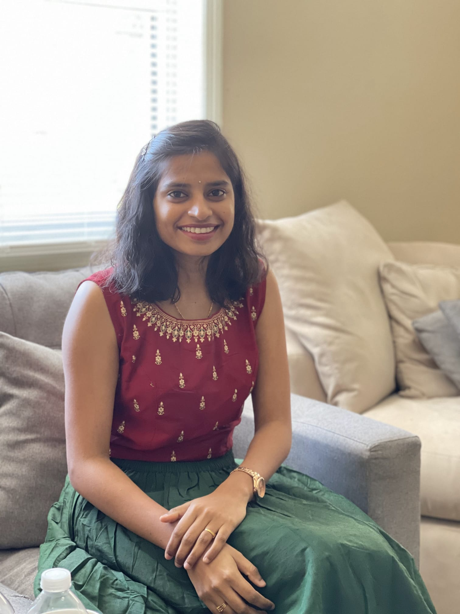

# Hello,
I’m Naveena Kota, an international student from India. Currently pursuing master's in computer science for this spring 2022. I finished my under-graduation in 2019 with a major in Electronics and Communication Engineering from Andhra University. As I am a student from electronics background, I have less expertise with computer science and programming courses but managed to gain knowledge in C, Java. After continuous learning and practice in these two programming courses, now I feel I am pretty good at them.  After my undergrad, I worked as Software developer in TCS. Here I was exposed to the various software tools such as C, Java, UNIX, Linux, Operating Systems and various other tools like github, jcat, Jenkins. We as a team worked with Ericsson client for connectivity packet platform (CPP) project and this helped me build knowledge and expertise on how the communication happen between radio network controllers via media gateway. In this project, I worked on WCDMA and LTE applications to be used when developing ATM (Asynchronous Transfer Mode) and IP (Internet Protocol) based nodes.

For this semester, I have registered for the course Advanced Web Programming, I went through the email sent by you professor and I found the description of the course and the concepts that we are going to use in near future for the project (an app to track exercise habits) very interesting. Like I described myself in the previous paragraph and mentioned that I just have expertise with two programming languages. So I believe that I will be learning a lot of new concepts, and work with different technologies over the course time. Previously, I never got a chance to develop website on a whole and to integrate both frontend and backend. I consider taking this course as a great opportunity and I am very much excited to develop a website all by myself.

 

